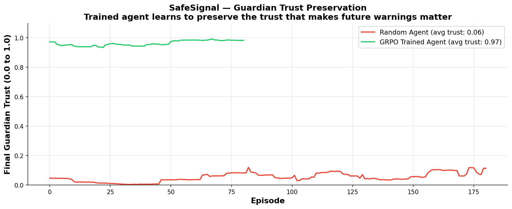
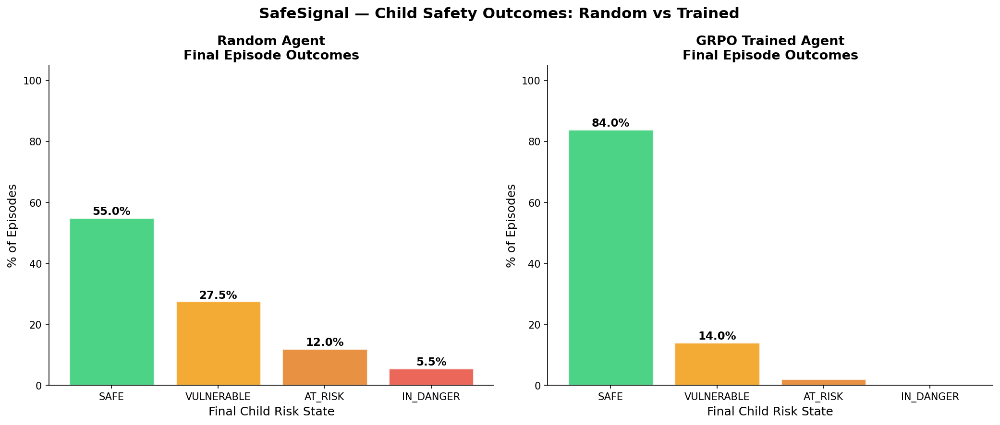

# 🛡️ SafeSignal — Child Digital Wellbeing AI

> **Teaching AI to know when to act, when to wait, and how to keep the trust that makes future warnings matter.**

**Live Demo:** [huggingface.co/spaces/shakthiabi06/safesignal](https://huggingface.co/spaces/shakthiabi06/safesignal)

---

## The Problem

A 13-year-old comes home from school. Spends 4 hours on her phone. Her parents assume she is talking to friends.

What they cannot see:
- Three weeks ago a stranger began messaging her on Instagram
- Conversations started casual — music, games, compliments
- Slowly the person asked her to keep conversations private
- Her messages to her actual friend group dropped 60% over two weeks
- She started being active at 1am and 2am
- Her emotional tone in her posts shifted from happy to flat to absent

Her parents noticed she seemed quieter. But they did not want to violate her privacy. So they waited.

**Parents are either fully invasive or completely blind. No tool exists that says — something feels different, you might want to have a conversation with your child today.**

SafeSignal attacks this gap — not by reading messages, but by learning the behavioral patterns that precede harm, and knowing *when* to act on them without destroying the parent-child relationship in the process.

---

## What SafeSignal Does

SafeSignal is a **reinforcement learning training environment** that teaches an AI agent to:

- Detect shifts in a child's online behavioral patterns using metadata only — never message content
- Decide each day from four actions: stay silent, send a gentle nudge, recommend a check-in, or send an urgent alert
- Preserve guardian trust as a degradable resource — an agent that cries wolf loses the ability to protect the child
- Learn that **silence is sometimes the most powerful action**

The agent never sees the true risk state. It must infer danger from behavioral shadows alone — a **Partially Observable Markov Decision Process (POMDP)**, the core technical novelty of this system.

---

## The Seven Behavioral Signal Clusters

SafeSignal observes behavioral metadata only — never message content:

| Cluster | What It Measures |
|---|---|
| Reciprocity Imbalance | Who initiates, message length ratio, pursuit score |
| Conversation Timing Drift | Late night activity rate, timing shift over 14 days |
| Platform Migration Pressure | Volume cliffs, migration readiness score |
| Secrecy Signal Cluster | Response time variance by hour, family avoidance |
| Emotional Dependency | Rescue pattern score, mood correlation with contact |
| Social Graph Compression | Friend group decline, single contact concentration |
| Transaction Signals | Digital gifts, unexplained account credits |

---

## The Action Space

| Action | When Used |
|---|---|
| `OBSERVE_QUIETLY` | Risk low, trust fragile, or silence preserves future effectiveness |
| `GENTLE_AWARENESS` | Early signals emerging, high guardian trust |
| `PARENT_CHECK_IN` | Confirmed AT_RISK signals, sufficient trust |
| `URGENT_SUPPORT` | IN_DANGER state, trust still sufficient |

**Teaching the agent that silence is sometimes optimal is the central training challenge.**

---

## Results

| Agent | Avg Reward | % Ended Safe | Avg Final Trust |
|---|---|---|---|
| Random (untrained) | -44.13 | ~15% | 0.00 |
| Always Silent | +16.56 | ~60% | 1.00 |
| GRPO Trained | +18.52 | 84% | 0.97 |


*GRPO trained agent vs random baseline. Trained agent beats always-silent benchmark.*


*Guardian trust preservation. Random agent destroys trust. Trained agent maintains 0.97 average.*


*Final child risk state distribution. Trained agent produces 84% SAFE outcomes.*


*Individual composable rubric scores during training.*

---

## Privacy Architecture

Five design decisions built into the architecture, not added afterward:

1. **Behavioral metadata only** — never message content
2. **No data storage** — rolling window processing, signals discarded after use
3. **Child is a participant** — must consent at setup, can deactivate anytime
4. **Conversation prompt output only** — guardian receives a nudge, not a report
5. **Calibrated to external threats only** — not useful for controlling parents to use against their children

---

## Technical Architecture

- **Environment:** OpenEnv POMDP — hidden risk state never visible to agent
- **Three child archetypes:** Explorer, Withdrawer, Target — each with different baselines and signal signatures
- **Guardian trust model:** Degrades on false alarms, recovers on silence, compounds on fatigue
- **Composable rubric system:** Intervention timing (40%), guardian trust (30%), silence intelligence (20%), long-term outcome (10%)
- **Base model:** Llama 3.2 1B fine-tuned with HuggingFace TRL + GRPO
- **Quantization:** Unsloth 4-bit LoRA for free GPU training

---

## Repository Structure

```
safesignal/
├── environment/          # OpenEnv simulation, archetypes, reward function
│   ├── safesignal_env.py # Main environment — reset() and step()
│   ├── simulated_child.py# Child behavior generator
│   ├── rubrics.py        # Composable reward rubric system
│   ├── episode_tracker.py# Multi-episode statistics
│   └── signals/          # Seven behavioral signal cluster implementations
├── training/             # Training pipeline
│   ├── train_grpo.py     # GRPO training script
│   ├── prompt_builder.py # State-to-prompt conversion
│   └── baseline.py       # Random agent baseline
├── demo/                 # Gradio demo interface
│   ├── demo_app.py       # Four-tab Gradio application
│   └── demo_scenarios.py # Deterministic demo episodes
├── results/              # Training results
│   └── baseline_rewards.json
├── openenv.yaml          # OpenEnv manifest
└── app.py                # HuggingFace Spaces entry point
```

---

## Run Locally

```bash
git clone https://github.com/Praneeth1506/OpenENV-Environment
cd safesignal
pip install -r requirements.txt
py app.py
```

---

## Research Calibration

Parameters calibrated to published research:
- **Thorn (2021)** — grooming timelines, isolation patterns
- **CCRC UNH** — online victimization studies, risk escalation rates
- **Pew Research (2023)** — teen social media baseline behaviors
- **IWF (2023)** — late night activity correlation data
- **JAMIA (2019)** — alert fatigue threshold research

---

## Links

- **Live Demo:** [HuggingFace Space](https://huggingface.co/spaces/shakthiabi06/safesignal)
- **Training Notebook:** *(Colab link — add when available)*
- **Blog Post:** [HuggingFace Model Card](https://huggingface.co/shakthiabi06/safesignal-blog)
- **Team Repo:** [GitHub](https://github.com/Praneeth1506/OpenENV-Environment)